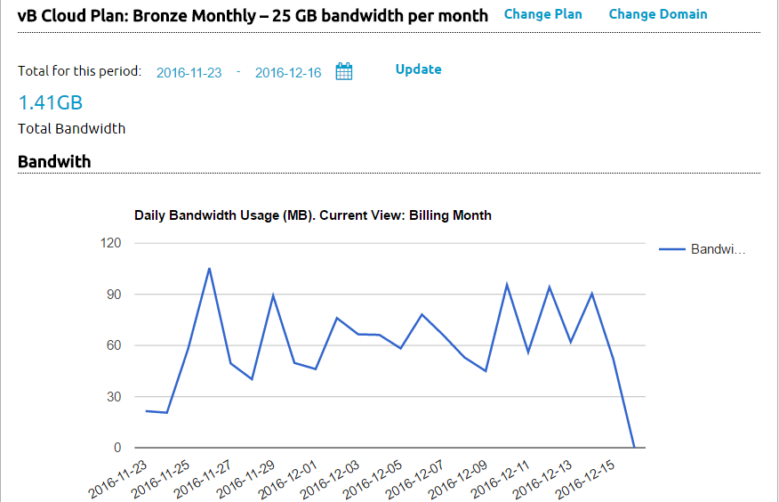

The Cloud Console is where you control your vBulletin Cloud Account.

## Dashboard
The dashboard is the main point of entry into your cloud console. There are two things available on this screen, your domain name control and bandwidth used. The screen also tells you how to enable Google Analytics. 
### Domain name
This will tell you if your custom domain name is currently active. You can activate or deactivate your custom domain in this area. If you want to change your domain name you can do so by clicking on the link labeled Change Domain. Clicking on the Change Plan link will direct you to the Contact Us page and allow you to request a new package. Plan changes are prorated.
### Bandwith
This bandwidth graph shows your usage for the last 30 days. You can use the controls above the graph to view other periods of time.

## Billing History
This page presents a table of every charge made to your Cloud Account.
## Account Information
The Account Information allows you to change your account password or domain name. If you need to change other information on the account, please contact us.
## Contact Us
This provides a form to allow you to request changes to your account or open a support ticket if there is an issue with your account or vBulletin Cloud Site.